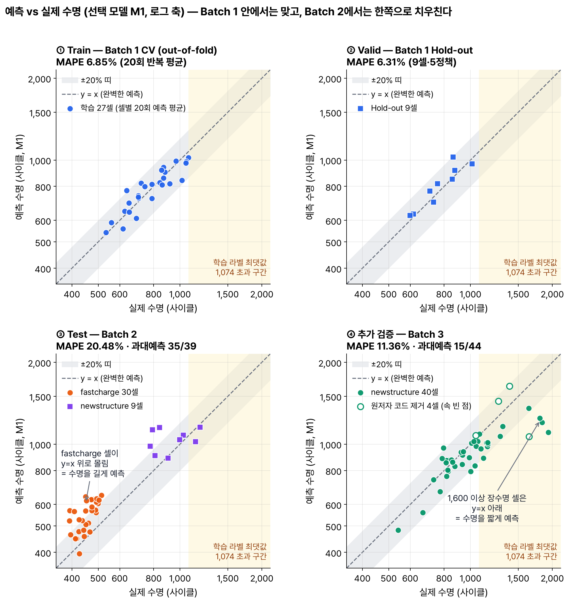
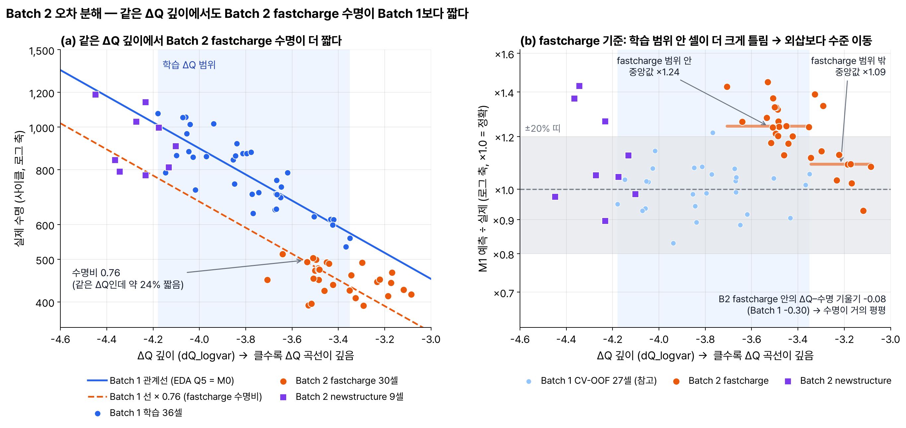

# ESS 배터리 수명 예측

**목적:** ESS에서 용량이 줄기 전에 셀 교체 시점을 미리 계획한다. 셀의 첫 100 사이클 데이터만으로 수명(cycle_life)을 예측하고, 원논문(MAPE 9.1%)과 비교해 배치가 바뀔 때 생기는 차이(Gap)를 해석한다.

> **결과 요약**
> - 최종 모델: ΔQ 깊이 + 초기 용량, 두 피처의 선형 회귀(M1, Ridge).
> - Batch 1 안 검증(Train CV 6.85% · Valid 6.31%)은 목표보다 좋고 과적합 신호가 없다.
> - Batch 2 Test는 20.48%로 목표(9.1%)에 못 미쳤다. 39셀 중 35셀을 길게 예측한 한 방향 치우침이다.
> - Gap 원인: Batch 2 고속충전 셀은 ΔQ 깊이가 같은 Batch 1 셀보다 짧게 살았다(배치 수준 이동). 예측을 공통 배율 하나로 낮추면 9.87%가 되어, Gap(Valid-Test)의 약 3/4이 이 치우침이다(사후).
> - Batch 3(선택)는 11.36%, 원논문 2차 테스트와 같은 40셀로는 10.77%(원논문 10.7%)다.
> - ESS 시사점: 같은 배치 안에서는 cycle 100에 교체 계획 초안을 잡을 수 있지만, 배치가 바뀌면 예측이 한 방향으로 밀린다. 새 배치마다 참조 셀로 수준을 다시 맞춘 뒤 쓴다.

> **읽는 법:** '사후' = 테스트 라벨을 본 뒤의 원인 분석(모델·보고 성능은 그대로). 원저자 공개 코드·논문 Table 1에서 온 사실, Batch 2 기록 공백, Batch 3 제거 셀 정정은 모두 Test 실행 뒤에 확인했다. 상세 근거는 접힌 부분과 [notebooks/03_modeling.ipynb](notebooks/03_modeling.ipynb)에 있다.

## 프로젝트 개요

- 데이터셋 : MIT-Stanford Battery Dataset (Severson et al., Nature Energy 2019)
- 학습 데이터 : Batch 1 (2017-05-12) — 수명 라벨 36셀. EOL에 닿기 전에 기록이 끝난 10셀(중도절단)은 타깃에서 뺐다.
- 평가 데이터 : Batch 2 (2018-02-20) — 라벨 39셀(fastcharge 30 + newstructure 9) 1회. 추가 검증 Batch 3 (2018-04-12) 44셀 1회.
- 태스크 : Regression (Cycle Life 예측) — Batch 1에는 550 사이클 미만 셀이 1개뿐이라 장단수명 분류 경계를 배울 수 없다. log10(cycle_life)를 학습하고 원 단위 MAPE로 평가한다.

## 파일 구조

```
ess-battery-project/
├── data/README.md                 원본 받기·추출 방법 (원본 .mat·.pkl은 저장소에 없음)
├── docs/data_notes.md             데이터 규칙 (사이클 번호, 중도절단, 측정 오류)
├── notebooks/
│   ├── 01_EDA.ipynb               노션 EDA 질문 Q1~Q5
│   ├── 02_feature_engineering.ipynb   피처 정의·계산, cycle ≤ 100 확인
│   └── 03_modeling.ipynb          분할·모델 선택·성능 표·Gap 해석·오류 분석
├── src/
│   ├── preprocess.py · data.py · features.py   .mat → pkl, 정제, 피처 계산(cycle ≤ 100 강제)
│   ├── train.py                   select / valid / test / batch3 / report 단계
│   ├── error_analysis.py · check_rest_gap.py   저장된 예측으로 오류 분석, Batch 2 기록 공백 점검
│   └── eda/                       DAY 1 EDA 스크립트
├── results/
│   ├── model_performance*.csv     노션 Reporting format 표 (M1 / M0, Batch 3)
│   ├── model_candidates.csv · holdout_cells.csv · features.csv
│   ├── selection·valid·test·batch3.json, *_predictions.csv   단계별 기록·셀별 예측
│   ├── error_analysis.json · run_log.txt   오류 분석 수치 · 모든 실행 기록
│   └── eda/                       DAY 1 EDA 수치
├── reports/
│   ├── DS-MINI-Design-울산_2반-김진녕.pdf · day1_design_report.md   DAY 1 자료 (설계 보고서 = 테스트 전 기록)
│   └── figures/
├── requirements.txt
└── README.md
```

## 환경 설정

```bash
git clone https://github.com/thanksdooss/ess-battery-project
cd ess-battery-project
python3.11 -m venv .venv && source .venv/bin/activate
pip install -r requirements.txt        # Python 3.11.15, 버전 고정
python -m ipykernel install --user --name ess-venv
```

- 결과만 확인(데이터 불필요): `notebooks/03_modeling.ipynb`를 실행한다. 저장된 예측으로 MAPE를 다시 계산해 표와 같은지 확인한다.
- 모델 단계 재현(원본 불필요): `train.py`는 저장소의 `results/features.csv`·`holdout_cells.csv`·`diagnostic_features.csv`만 읽는다. `--stage select / valid / test / batch3 / report` 순서(select 약 2분). 저장소에는 1회 실행 표식(`results/.test_done`·`.batch3_done`)이 있어 select부터 거부된다(테스트 뒤 재선택 방지). 자기 사본에서 이 두 표식만 지우거나 `--force`(run_log에 기록)를 쓴다. 사후 분석 `error_analysis.py`도 저장된 예측만 읽는다.
- 피처부터 재현(원본 필요): [data/README.md](data/README.md)로 원본(약 7.7GB)을 받은 뒤 `preprocess.py` → `features.py` → 위 순서, 사후 분석 `check_rest_gap.py`도 원본이 필요하다. 난수 고정: `random_state = 42`, 반복 외부 CV는 seed 42\~61.

<details><summary>핵심 코드 위치 (채점용)</summary>

| 단계 | 위치 | DAY 1 근거 |
|---|---|---|
| 미래 정보 차단 (cycle 101 이후 접근 시 오류) | `src/features.py` `EarlyCycles` (L71) | §8 |
| 피처 목록 (M1 = ΔQ 깊이 + 초기 용량, M2 = 10개 풀) | `src/features.py` `M1_FEATURES`·`M2_POOL` (L56) | §8 |
| Hold-out 생성·분할 (정책 겹침 0 assert) | `src/eda/q5d_conditional.py` `holdout_split` (L106), `src/train.py` `split_batch1` (L246) | §11 |
| 후보·튜닝 범위 | `src/train.py` `SPECS` (L191) | §10 |
| 정책 단위 CV · 외삽 게이트 · 1-SE 규칙 | `outer_splits` (L321), `gate_check` (L395), `one_se_rule` (L440) | §11 |
| Test 1회 보호 | `guard_once` (L574), `stage_test` (L911) | §11 |
| Batch 3 제외 셀 (테스트 뒤 정정) | `B3_PAPER_REMOVED` (L93), `batch3_excl_corrected` | §11 |

- Windows에서는 `git clone -c core.autocrlf=false`, `PYTHONUTF8=1`로 실행한다. 피처를 다시 계산해 해시를 맞추는 확인은 macOS/Linux 기준이다.

</details>

<details><summary>실행 기록 (results/run_log.txt 발췌, 공개 사항)</summary>

```
2026-10-01T15:18:30  select  selected=M1 params={'model__alpha': 0.0001}
2026-10-01T15:18:52  valid   valid_mape=6.310 M0=6.313
2026-10-01T15:37:12  select  selected=M1 params={'model__alpha': 0.0001}   (2번째 select, Valid를 본 뒤)
2026-10-01T15:37:25  valid   valid_mape=6.310 M0=6.313
2026-10-01T16:04:30  test    selected=M1 test_mape=20.480 M0=28.559 forced=False
2026-10-01T16:04:42  batch3  selected=M1 b3_mape=11.357 excl4=10.336 forced=False
2026-10-02T09:34:22  correction  B3 원저자 제거 셀 #38·#39→#42·#43 정정, 저장 예측으로 재계산: M1 10.336→10.767
```

- 순서: DAY 1 설계 보고서(§10 전략·§11 가설) 최종 수정 10-01 15:04(로컬 파일 시각) → select 15:16 → Test 16:04(`results/run_log.txt`). 설계 보고서 내용은 그 뒤 바뀌지 않았다(GitHub 표시용 `~` 이스케이프만 추가).
- **공개:** Valid는 4회, select는 2회 계산됐다(선택 모델과 Valid 값은 매번 같음). DAY 1 기록(`results/eda/strategy_final.json`)의 Batch 3 제거 셀 목록(#38·#39 포함, 셀 번호 대응 미확인)이 틀려, 테스트 뒤 원저자 공개 코드로 #02·#37·#42·#43으로 바로잡고 저장된 예측으로 제외 결과만 다시 계산했다(10.34 → 10.77%). 모델·Batch 3 44셀 결과(11.36%)는 그대로다.

</details>

## EDA

그림과 통계 상세는 [DAY 1 발표 자료 (PDF)](reports/DS-MINI-Design-%EC%9A%B8%EC%82%B0_2%EB%B0%98-%EA%B9%80%EC%A7%84%EB%85%95.pdf)와 [notebooks/01_EDA.ipynb](notebooks/01_EDA.ipynb)에 있다. 장수명 = 1,000 초과, 단수명 = 500 미만(노션 Q1 기준).

- **Cycle Life 분포**
  - 분포 형태 및 장단수명 비율 요약 : Batch 1은 한 덩어리(534\~1,074), Batch 2는 두 봉우리, Batch 3는 긴 꼬리다. 장수명 5/36 · 3/39 · 23/44, 단수명 0 · 28/39 · 0 (B1 · B2 · B3). 노션의 "Batch 1/2는 유사"는 재현되지 않았다(KS D 0.77 > B1↔B3 0.47).
  - 핵심 발견 : 학습 배치에 550 미만 셀이 1개뿐이라 장단수명 경계를 배울 수 없다 → 회귀.
- **열화 곡선 분석**
  - 장수명 vs 단수명 셀의 열화 속도 차이 : 거의 모든 셀이 '살짝 상승 → 완만 → 급락' 순서이고, 단수명 셀은 완만한 구간이 짧다. 말기 속도는 중기의 약 9배다.
  - Knee point 존재 여부 및 발생 시점 : 첫 100 사이클 안의 knee는 0셀이고, 대체로 수명의 약 75% 지점이다.
  - 핵심 발견 : 첫 100 사이클엔 용량이 거의 줄지 않는다(손실의 약 0.6%) → 용량 곡선·knee 대신 ΔQ(V)를 쓰고, 입력 사이클 상한을 코드로 강제한다.
- **ΔQ(V) 곡선 분석**
  - Cycle 100 - Cycle 10 차이 곡선 형태 : 모든 셀에서 2.9\~3.0 V 부근에 아래로 골이 생긴다.
  - 장단수명 셀 간 ΔQ 형태 비교 : 모양은 거의 같고, 단수명 셀일수록 골이 깊다.
  - 핵심 발견 : 골의 깊이(ΔQ 깊이, dQ_logvar)가 Batch 1 log 수명 분산의 71%를 설명한다 → 모든 모델의 주 피처.
- **충전 속도(C-rate)와 수명의 관계**
  - 충전 프로토콜별 평균 수명 비교 결과 : Batch 1 정책 20개의 평균 수명은 546.5\~1,074로 약 2배 갈린다. 충전이 빠를수록, 특히 고전류 비중이 클수록 짧았지만(927 → 675) 이 신호는 ΔQ 깊이와 거의 같은 정보였다.
  - 핵심 발견 : 충전 조건은 피처에서 빼고, 같은 정책 셀이 학습·검증에 나뉘지 않게 정책 단위로 나눈다.
- **추가 확인한 내용 (Q5 상관관계, 노션 Qdlin 경고)**
  - ΔQ 깊이를 통제해도 초기 용량은 수명과 함께 움직였다(같은 정책 복제쌍 16개 중 14개). 노션의 "Qdlin 변수를 단순 비교하면 왜곡 발생"도 확인했다(배치 간 Qdlin 오프셋이 수명 신호와 크기가 같음).
  - 핵심 발견 : 초기 용량은 보완 신호지만 배치 기준선에 민감하다 → 후보(M1)로 두고 ΔQ만 쓰는 M0를 항상 함께 적는다.

## Modeling

### 피처 엔지니어링 전략

모든 피처는 cycle 2\~100만 쓴다([notebooks/02_feature_engineering.ipynb](notebooks/02_feature_engineering.ipynb)).

| 피처 | 정의 | 근거 (EDA, Batch 1) | 사용 모델 |
|---|---|---|---|
| **ΔQ 깊이** (dQ_logvar) | log10 var(Q₁₀₀(V) − Q₁₀(V)) | 혼자서 log 수명 분산의 71% 설명. 같은 셀의 차분이라 배치 오프셋이 상쇄된다 | 전 모델 (M0는 이것만) |
| **초기 용량** (Qcc_init) | cycle 2\~6 정전류 방전 끝(2.0 V) 용량 중앙값 | ΔQ가 놓친 같은 정책 셀 간 차이를 설명한다 | M1\~M4 (후보) |
| M2 전용 8개 | break-in, ΔQ 왜도·첨도, 91\~100 기울기, 충전시간, 온도, 내부저항 2개 | 원논문 피처 대응, 겹치는 것은 묶음 대표만 | M2 |
| 제외 | 충전 정책·C-rate, knee, 용량 기울기, 원시 Qdlin 수준 | knee는 미래 정보, 충전·기울기는 ΔQ와 중복, 원시 Qdlin은 노션 경고 | — |

- 초기 용량 효과의 일부는 고정 EOL(0.88 Ah)까지의 여유에서 나오므로 '셀이 더 건강하다'로 읽지 않는다.
- **공개:** 피처 후보를 고른 DAY 1 EDA는 Hold-out 9셀을 포함한 Batch 1 36셀로 했다. Valid가 조금 낙관적일 수 있다.

### 모델 선택 및 근거

- 후보 모델 : M0 OLS(ΔQ만, 원논문 variance model) → M1 Ridge(+초기 용량) → M2 ElasticNet(10개) → M3 GPR → M4 RF·GBR(비선형 진단). 단순한 순서.
- 최종 모델 : **M1** = StandardScaler → Ridge(alpha 1e-4), 입력 [ΔQ 깊이, 초기 용량], 타깃 log10(cycle_life).
  - Batch 1 36셀 재적합 식: log10(cycle_life) = −1.87 − 0.328 × ΔQ 깊이 + 3.30 × 초기 용량[Ah]. ΔQ 분산이 10배면 수명 ×0.47, 초기 용량이 10 mAh 크면 ×1.08이다([results/test.json](results/test.json) `coefs_raw_fit36`).
- 선택 이유 :
  - DAY 1에 미리 정한 규칙(CV 최저 + 표준오차 1개 안에서 가장 단순한 모델)을 그대로 따랐다. M1이 CV 최저(6.85%)였고, 범위 안의 M3(GPR)보다 단순하다.
  - 학습 셀이 27개뿐이라 피처를 늘리면 과적합이었다(M2: 학습 적합 4.84% vs CV 9.41%). M1은 5.98% vs 6.85%로 차이가 작다.
  - 선형이라 학습 범위 밖 값도 낼 수 있다. 트리(M4)는 범위 밖 수명을 못 내 외삽 게이트에서 탈락했고, 같은 이유와 36셀이라는 크기 때문에 딥러닝·LightGBM은 쓰지 않았다.
- 데이터 분할 : 노션의 Hold-out 사유(「CV를 적용하면 동일 프로토콜 셀이 train/valid에 나뉘어 들어가 데이터 누수(leakage) 위험 잔존」)를 정책 단위로 강화했다. Valid = CV보다 먼저 고정한 9셀·5정책, Train CV = 나머지 27셀로 정책 단위 GroupKFold(5) × 20회, Test = Batch 1 36셀로 다시 학습해 Batch 2에 1회.
- 학습 전략·튜닝 : 바깥 fold의 학습 셀 안에서 다시 정책 단위 GroupKFold(4)로 그리드 탐색(nested CV). 스케일링·결측 대체는 fold마다 학습 셀에만 fit했다. M1의 alpha는 탐색 하한(1e-4)이 골라져 사실상 OLS다(두 피처가 거의 겹치지 않음).

### DAY 1 전략 → DAY 2 구현

| DAY 1 계획 (설계 보고서 §) | DAY 2 구현·결과 | 판정 |
|---|---|---|
| 타깃 log10(cycle_life), 피처 M0 ΔQ / M1 +초기 용량 / M2 10개, cycle ≤ 100 (§8–9) | 목록 그대로 사전 고정, 코드에서 cycle 101 접근 시 오류 | 그대로 |
| Hold-out 9셀·5정책 선고정, 정책 단위 nested CV, 1 SE + 외삽 게이트 (§11) | 그대로 실행 → M1 선택 | 그대로 |
| 후보별 예상 위험 (§10) | M0 'B2 약 1.3배 과대' → ×1.32 · M2 '과적합 위험 최대' → 학습 4.84 vs CV 9.41 · M4 '게이트 구조상 위반' → 5/5 탈락 · M1 'B3 ×0.90 쪽' → ×0.92 | 예고대로 |
| M2가 M1로 수렴하는지를 피처 선별 근거로 본다 (§10) | M2는 10개 중 8개를 남겼지만 표준화 계수 ΔQ −0.075 · 초기 용량 +0.032가 M1(−0.075 · +0.030)과 같고, 나머지 6개는 ΔQ의 15% 이하였다. 내부 튜닝 값도 100 fold 중 가장 흔한 조합이 8회뿐이라 불안정 | 수렴 → 두 피처로 충분 |
| Valid는 1회만 (§11) | 4회 계산(값 6.31 동일, 선택 불변) | 변경 (공개) |
| 예측구간은 외삽 거리에 따라 넓힘 (§11) | 그대로 구현했지만 범위 밖 구간이 오히려 좁았다(평균 폭 20.7% → 12.8%) | 그대로, 기대와 반대 |
| Batch 3 원논문 제거 셀 포함/제외 병기 (§10) | DAY 1 목록(#38·#39) 오류 → 테스트 뒤 원저자 코드로 #02·37·42·43 정정, 저장 예측으로만 재계산 | 변경 (공개) |

<details><summary>후보 모델 비교 · 튜닝 범위</summary>

| 모델 | 입력 | Train CV MAPE (SE) | 1 SE 안 | 외삽 게이트 (위반/5) | 결과 | Valid · Test B2 · B3 (선택 뒤 기록) |
|---|---|---|---|---|---|---|
| M0 OLS | ΔQ 깊이 | 9.97 (1.33) | 아니오 | 통과 (1) | — | 6.31 · 28.56 · 12.81 |
| **M1 Ridge** | ΔQ 깊이 + 초기 용량 | **6.85 (0.92)** | 예 | 통과 (0) | **선택** | 6.31 · 20.48 · 11.36 |
| M2 ElasticNet | 10개 | 9.41 (1.28) | 아니오 | 통과 (1) | — | 5.65 · 19.50 · 16.41 |
| M3 GPR | M1 입력 | 7.04 (0.89) | 예 | 통과 (0) | M1보다 복잡 | 6.23 · 21.26 · 11.24 |
| M4 RF | M1 입력 | 10.63 (1.73) | 아니오 | 탈락 (5) | — | 7.12 · 29.38 · 18.13 |
| M4 GBR | M1 입력 | 9.49 (1.62) | 아니오 | 탈락 (5) | — | 6.10 · 27.03 · 18.97 |

- 마지막 열은 선택이 끝난 뒤 같은 1회 실행에서 함께 기록한 값이며 선택에 쓰지 않았다. M2는 Batch 2에서 M1보다 약 1%p 낮았지만 Batch 3에서 약 5%p 높았고, 어느 후보도 Batch 2에서 9.1%에 가깝지 않다(모델보다 배치 차이의 문제).

| 모델 | 튜닝한 값 | 탐색 범위 | 최종 |
|---|---|---|---|
| M1 Ridge | alpha | 1e-4 \~ 100, 로그 간격 25개 | 1e-4 (하한) |
| M2 ElasticNet | alpha · l1_ratio | 1e-4 \~ 1 (30개) × {0.1, 0.3, 0.5, 0.7, 0.9, 1.0} | 0.0033 · 0.3 |
| M3 GPR | 커널 길이·잡음 | fit 안에서 최대우도 | — |
| M4 RF (500 trees) | max_depth · min_samples_leaf | {2, 3} × {3, 5} | 3 · 3 |
| M4 GBR (lr 0.05, depth 2, min_samples_leaf 3, subsample 0.8) | n_estimators | {100, 300} | 100 |

- 1 SE 기준선 = 6.85 + 0.92 = 7.77%. 외삽 게이트 = Batch 1 중도절단 장수명 5셀의 '최소 수명' 중 3개 이상을 밑돌게 예측하면 탈락.
- 참고 행(선택 대상 아님): 상수 예측 19.44%(CV), Huber 6.87%, M2 discharge 7.60%. 잡음 셀 민감도: M1 CV 6.85 → 6.87, Valid 6.31 → 6.32.
- 전체 값: [results/model_candidates.csv](results/model_candidates.csv)

</details>

### 평가 지표

| 지표 | 왜 쓰나 |
|---|---|
| MAPE (%) — 주 지표 | 노션·원논문 기준. % 오차라 교체 계획 오차로 바로 읽힌다 |
| RMSE (사이클) — 보조 | 교체 시점이 몇 사이클 틀리는지 |
| 평균 부호 오차·과대예측 셀 수 — 보조 | (+) = 길게 예측 = 교체 지연. ESS에서는 조기 교체보다 비싼 오류라 방향을 따로 본다 |
| 순위상관 (Spearman) — 보조 | 같은 로트 안 교체 우선순위에 쓸 수 있는지 |

- 모델 선택은 노션 기준인 MAPE로만 했다. 교체 지연의 비대칭 비용은 부호 오차 보고와 '예측구간 하한으로 계획'하는 운영 규칙에만 반영했다(향후 과제).

## 성능 결과

**선택 모델 M1** — 노션 Reporting format (for Regression), [results/model_performance.csv](results/model_performance.csv)

| 구분 | MAPE (%) | 비고 |
|---|---|---|
| Train (Batch 1 CV) | 6.85 | 정책 단위 GroupKFold(5) × 20회 평균 (±SD 1.97) |
| Valid (Batch 1 Hold-out) | 6.31 | 9셀·5정책 고정 분할 |
| Test (Batch 2) | 20.48 | 39셀, 1회 |
| Gap (Train-Valid) | -0.54 | (+) : 과적합 의심 |
| Gap (Valid-Test) | +14.17 | (+) : 배치간 일반화 저하 의심 |
| Gap (Target-Test) | +11.38 | Target : 원논문 9.1% |

※ Gap = 뒤 단계 − 앞 단계(노션 비고의 (+) 뜻 유지), 반올림 전 값으로 계산. 상수 예측 기준선(학습 중앙값)은 Train CV 19.44% · Test(Batch 2) 58.71%, RMSE는 Batch 1 안 약 65 · Batch 2 약 130 사이클이다.

**Gap 해석** (Gap(Target-Test)는 노션 요구대로 Batch 2 기준)

- **Train-Valid (-0.54): 과적합 신호는 없다.** Train이 Valid의 95% CI(3.47\~9.91%) 안에 있다. 9셀뿐이라 '큰 과적합은 없다'까지만 말한다. 셀별 APE는 #16만 18.9%이고 나머지 8셀은 0.7\~8.5%다.
- **Valid-Test (+14.17): Batch 1을 외워서가 아니라, Batch 2 셀이 같은 신호에서 더 짧게 살았다.**
  - 같은 ΔQ 깊이에서 Batch 2 fastcharge 수명은 Batch 1 관계선의 약 0.76배다. 후보 6개 모두 Batch 2에서 19.5\~29.4%라 모델 종류보다 배치 차이의 문제다.
  - 예측을 공통 배율 하나(×1.20)로 낮추면 9.87%가 된다(사후). Batch 2에만 ΔQ 측정 구간 안 약 66시간 기록 공백이 있어 원인 후보로 둔다.
- **Target-Test (+11.38): 목표 미달은 대부분 배치 이동에서 왔다.** Batch 1 안(Valid 6.31%)에서는 목표보다 2.79%p 좋았고, 배치가 바뀌며 14.17%p 나빠졌다. 원논문 테스트셋에는 이 Batch 2 파일이 없고, 같은 조건(Batch 3 40셀)에서는 원논문 10.7% vs M1 10.77%로 비슷하다(아래 접힌 표). Batch 2 라벨로 모델을 다시 맞추지 않았다(테스트 누수).

<details><summary>원논문 9.1%와 비교 조건 (테스트 뒤 원저자 공개 코드·Table 1에서 확인)</summary>

- 노션 데이터 표는 Batch 2(2018-02-20)를 '원논문의 1차 테스트셋'으로 적었지만, 원저자 공개 코드의 1차 테스트셋은 2017-05-12·2017-06-30 셀을 학습과 번갈아 나눈 것이다([docs/data_notes.md](docs/data_notes.md)). 9.1%는 계산식이 없고, Full 모델의 7.5%(42셀, 이상 셀 1개 제외)와 10.7%(40셀)를 셀 수로 평균하면 9.06%라 둘을 합친 값으로 보인다.

| 비교 조건 | 원논문 Full | 이번 M1 |
|---|---|---|
| 같은 시기 배치 안의 테스트 | 7.5 (1차, 42셀, 이상 셀 1개 제외) | 6.31 (Hold-out, 9셀) |
| 나중 배치 2018-04-12 (= Batch 3) | 10.7 (2차, 40셀) | 10.77 (같은 40셀) |
| 원논문에 없는 배치 2018-02-20 (= Batch 2) | — | 20.48 (39셀) |

- 같은 40셀에서 원논문 Variance 11.4 · Discharge 8.6 · Full 10.7%, 이번 M0 11.75 · M1 10.77%다.

</details>



*Batch 1은 y = x 주변, Batch 2는 위(길게 예측), Batch 3 장수명 셀은 아래(짧게 예측)로 치우친다. 속 빈 점은 원저자 코드가 뺀 Batch 3 4셀이다.*

- ΔQ만 쓰는 M0: Train 9.97 / Valid 6.31 / Test 28.56% (노션 Qdlin 경고 때문에 함께 적는다, 아래 접힌 표).

<details><summary>M0 (ΔQ 깊이만) — 노션 Reporting format</summary>

| 구분 | MAPE (%) | 비고 |
|---|---|---|
| Train (Batch 1 CV) | 9.97 | 정책 단위 GroupKFold(5) × 20회 평균 (±SD 3.01) |
| Valid (Batch 1 Hold-out) | 6.31 | 9셀·5정책 고정 분할 |
| Test (Batch 2) | 28.56 | 39셀, 1회 |
| Gap (Train-Valid) | -3.65 | (+) : 과적합 의심 |
| Gap (Valid-Test) | +22.25 | (+) : 배치간 일반화 저하 의심 |
| Gap (Target-Test) | +19.46 | Target : 원논문 9.1% |

</details>

**Batch 3 추가 검증 (선택 과제, M1)** — 노션 Reporting format (for Batch 3), [results/model_performance_batch3.csv](results/model_performance_batch3.csv)

| 구분 | | MAPE (%) | 비고 |
|---|---|---|---|
| Train (Batch 1 CV) | | 6.85 | |
| Valid (Batch 1 Hold-out) | | 6.31 | |
| Test (Batch 2) | | 20.48 | |
| | Gap (Train-Valid) | -0.54 | (+) : 과적합 의심 |
| | Gap (Valid-Test) | +14.17 | (+) : 배치간 일반화 저하 의심 |
| | Gap (Target-Test) | +11.38 | Target : 원논문 9.1% |
| Test (Batch 3) | | 11.36 | 44셀 1회 (원저자 코드가 품질 문제로 뺀 4셀을 빼면 10.77) |
| | Gap (Batch2-Batch3) | -9.12 | Test 성능 간 비교 |
| | Gap (Target-Test) | +2.26 | Batch 3 기준, 원논문 성능 비교 |

※ Gap(Batch2-Batch3) = Batch 3 − Batch 2, (−)면 Batch 3에서 더 좋다.

**Batch 3 Gap 해석**

- **Batch2-Batch3 (-9.12): ΔQ 깊이에는 배치 과적합 신호가 없고, 초기 용량은 배치에 민감하다.** Batch 3는 수명이 더 길지만 ΔQ–수명 관계는 Batch 1과 같다(약 0.98배). 노션 예상대로 Batch 1 안(6.31%)보다는 떨어졌지만 Batch 2보다는 좋았다. 초기 용량 때문에 M1은 Batch 3를 평균 7% 짧게 예측했다(조기 교체 쪽).
- **Target-Test, Batch 3 (+2.26): 원논문 2차 테스트셋에서는 목표와 가깝다.** 오차는 학습 라벨 상한(1,074)보다 오래 산 셀에 몰린다(오류 분석 ④).

<details><summary>M0의 Batch 3 표 · Test 상세 · 사후 분석 · DAY 1 가설 판정</summary>

M0 Batch 3: Test (Batch 3) 12.81 (4셀 제외 11.75), Gap (Batch2-Batch3) -15.75, Gap (Target-Test) +3.71.

| Test 상세 (M1) | Batch 2 | Batch 3 |
|---|---|---|
| MAPE 95% CI | 16.7 – 24.4 | 8.6 – 14.6 |
| RMSE (사이클) | 129.5 | 229.6 (40셀 218.0) |
| 그룹별 MAPE | fastcharge 21.87 / newstructure 15.85 | newstructure 11.36 |
| 평균 부호 오차 (+ = 길게 예측) | +19.3% | -7.1% |
| 길게 예측한 셀 | 35/39 | 15/44 |
| 80% 예측구간이 담은 셀 (범위 안 / 밖) | 2/22 · 4/17 | 16/23 · 6/21 |

- 예측구간 = Batch 1 교차검증 로그 잔차 10\~90% 분위(학습 ΔQ 범위 안/밖 따로). **공개:** DAY 1 계획은 외삽 거리에 따라 넓히는 구간이었지만, Batch 1 안의 범위 밖 잔차가 작아 범위 밖 구간이 오히려 좁다(평균 폭 20.7% → 12.8%). 방식은 테스트 뒤에 바꾸지 않았다.
- 사후: 공통 배율 제거 시 M1 9.87 (B2) · 11.15 (B3). 라벨 없이 잰 초기 용량 이동을 되돌리면 25.37 · 12.21. M1의 Batch 2 이득 8.1%p = 셀 차이 3.2 + 배치 수준 초기 용량 이동 4.9%p.

| DAY 1 가설 (설계 보고서 §11 요지) | 판정 | 근거 |
|---|---|---|
| H1 Gap(Valid-Test) 크게 (+), fastcharge 약 1.3배 과대예측 | 지지 (일관성 확인) | fastcharge 예측÷실제 중앙값 M0 ×1.32, M1 ×1.22. 사전 break-in 점검은 약한 양의 상관뿐. 사전 점검 셀 B2 #43(품질 플래그)은 실제 1,029 · 예측 1,080(+4.9%)으로 큰 오차 없음 |
| H2 newstructure 편향 작고 산포 큼 | 부분 지지 | 중앙값 ×1.05, 평균 +12.5% |
| H3 오차는 짧은 셀이 지배 | 부분 지지 | 550 미만 셀이 셀 수 77%, 오차 합 82% |
| H4 Gap(Train-Valid)는 Valid CI로 판정 | 지지 | Train 6.85가 CI 안 |
| H5 Gap(Target-Test) (+) | 지지 | 후보 6개 모두 19.5\~29.4% |
| H6 Gap(Batch2-Batch3) (−), M1이면 ×0.90 쪽 | 지지 | M1÷M0 예측 비 중앙값 ×0.92 |

- H4를 뺀 가설의 기준값(수명비, B2 짧은 셀 범위, B2 하한 14.7%, B3 수명비)은 DAY 1 EDA에서 Batch 2·3 라벨로 계산했으므로(노션 DAY 1 대상 = Batch 1+2+3) '지지'는 사전 예측의 적중이 아니라 일관성 확인이다. 기록 공백은 테스트 뒤에 찾은 것이라 판정 근거에 넣지 않았다. 전체: [results/error_analysis.json](results/error_analysis.json)

</details>

## 오류 분석

**모델이 가장 크게 틀린 셀의 공통점** (오차 상위 10셀. 전체 목록은 [notebooks/03_modeling.ipynb](notebooks/03_modeling.ipynb) 5절과 [results/error_analysis.json](results/error_analysis.json)의 `worst_cells`)

| 셀 | 그룹 · 정책 | 실제 | 예측 | 오차 |
|---|---|---|---|---|
| B2 #06 | fastcharge · 3.6C(9%)-5C | 393 | 569 | +44.8% |
| B2 #09 | newstructure · 5.6C(26%)-4.5C | 791 | 1,131 | +42.9% |
| B2 #18 | fastcharge · 5.2C(50%)-4.25C | 449 | 640 | +42.6% |
| B2 #21 | fastcharge · 6C(60%)-3C | 408 | 566 | +38.8% |
| B2 #29 | fastcharge · 5.2C(58%)-4C | 452 | 619 | +37.0% |
| B3 #38 | newstructure · 5C(67%)-4C | 1,935 | 1,104 | −42.9% |
| B3 #42 † | newstructure · 4.8C(80%)-4.8C | 1,642 | 1,067 | −35.0% |
| B3 #07 | newstructure · 4.8C(80%)-4.8C | 1,836 | 1,203 | −34.5% |

† 원저자 코드가 품질 문제로 뺀 셀.

- Batch 2: 10셀 모두 길게 예측했고 8셀이 fastcharge 단수명 셀이다. 6셀은 ΔQ 깊이가 학습 범위 안이라 외삽보다 '같은 ΔQ에서 수명이 짧아진 수준 이동'이 원인이다. 정책으로 보면 fastcharge 30셀 중 29셀을 길게 예측했고, 2셀 이상인 정책 9개 중 8개는 셀이 모두 길게 예측됐다(정책별 MAPE 7\~36%). 같은 정책 셀이 함께 틀렸으므로 셀 하나가 아니라 배치·정책 수준의 이동이다.
- Batch 3: 8셀은 반대로 짧게 예측했고, 그중 6셀은 학습 라벨 최댓값(1,074)보다 오래 살았다(1,074 초과 16셀 전체 MAPE 19.1%, 나머지 28셀 6.9%). 2셀은 원저자 코드가 품질 문제로 뺀 셀이다.



*(a) 같은 ΔQ 깊이에서 Batch 2 fastcharge 수명은 Batch 1 선의 약 0.76배다. (b) fastcharge에서는 학습 범위 안의 셀이 더 크게 틀렸다 → 외삽보다 수준 이동.*

**원인 가설 및 개선 방향** (상관에 근거한 가설, 인과는 확인하지 않음)

| 원인 가설 | 근거 | 개선 방향 (향후 과제) |
|---|---|---|
| ① 배치(셀 로트·시험 시기) 수준 이동 | 같은 ΔQ·같은 정책에서도 Batch 2가 짧다. 공통 배율 하나를 빼면 20.48 → 9.87% | 새 로트마다 참조 셀 몇 개로 수명 수준만 다시 맞춘다 |
| ② Batch 2 시험 이력 (ΔQ 구간 안 약 66시간 기록 공백) | Batch 2 라벨 39셀 모두에 있다(Batch 1·3 없음). 모든 셀에 있어 영향 크기는 가릴 수 없다 | 긴 정지를 감지해 예측을 '참고용'으로 표시, 공백 없는 구간으로 ΔQ 재정의(Batch 1 CV로만 검증) |
| ③ 초기 용량의 배치 기준선 이동 (노션 Qdlin 경고) | 테스트 전 예고(×0.90)대로 Batch 3를 짧게 예측(M0 +1.6% → M1 −7.1%) | 셀 자기 기준(상대값)으로 재정의, 이동이 크면 경보 |
| ④ 학습 라벨 범위 밖 외삽 (장수명) | 1,074 초과 셀의 MAPE 19.1%. 과제 데이터엔 원저자가 쓴 장수명 연장 기록이 없다 | 중도절단 셀의 '최소 수명' 정보를 쓰는 회귀(생존분석) |

- 공통 개선: 라벨 없이 쓸 수 있는 입력 품질·분포 이동 경보와, 여러 배치로 학습해 배치를 하나씩 빼고 검증하는 방식. Batch 2를 학습에 쓰면 더 이상 테스트가 아니므로 이번에는 하지 않았다.

## ESS 도메인 해석

분석 결과를 실제 ESS 운영 관점에서 해석한다. ESS 셀은 리튬 손실·SEI 성장 같은 원리로 열화하고 BMS는 그 결과를 SOH로 잰다(노션 배경). 이 데이터에서는 cycle 100 SOH가 아직 약 100%라 SOH만으로는 수명을 가를 수 없고, ΔQ(V)는 용량이 줄기 전 방전 곡선의 변화를 본다.

**이 모델을 실제 BESS에 적용한다면 어떤 의사결정에 활용 가능한가?**

| 의사결정 | 근거 | 조건 |
|---|---|---|
| 교체 시점·예산 계획 (노션: 교체 비용 = CAPEX의 30–40%) | 같은 배치 안 RMSE 약 65 사이클(MAPE 6–7%), SOH 알람보다 준비 기간이 길다 | 같은 배치·조건일 때만. 교체 계획은 예측구간 하한으로 잡되, 새 배치의 셀은 구간을 믿지 않는다 |
| 같은 로트 안 점검·교체 우선순위, 팩 구성 | 순위상관 0.85 (Batch 3) | 같은 로트 안에서만. Batch 2 fastcharge 안에서는 0.67로 약하다 |
| 단수명 의심 셀 우선 점검 (예측 < 550) | Batch 2 경보 13셀 모두 실제 단수명(<500). 다만 거의 모든 셀을 길게 예측한 편향의 부산물에 가깝다(사후) | 단수명(<500) 28셀 중 15셀은 놓쳤다. '경보 없음'을 '안전'으로 읽지 않는다 |
| 충방전 전략(EMS) 최적화 | 이 모델로는 근거가 없다(충전 조건은 피처에서 뺐고 배치마다 달랐다) | 충전 조건을 바꾼 별도 실험이 필요 |

**어떤 한계가 있으며, 실 배포를 위해 추가로 필요한 것은 무엇인가?**

- 한계
  - 학습 배치가 1개(36셀)라 Batch 1 안의 검증으로는 배치 이동이 보이지 않았다. 배치가 바뀌면 예측이 한쪽으로 밀린다(Batch 2 평균 약 97 사이클 길게 = 교체 지연, Batch 3 약 7% 짧게 = 조기 교체). 하루 1사이클로 가정하면 Batch 2는 교체가 약 3개월 늦어 정전·위약금 위험이 생기고, Batch 3는 셀 수명의 약 7%를 버리는 셈이라 노션의 셀 교체 비용(1 MWh당 $30,000\~80,000)으로 약 $2,100\~5,700/MWh다(가정에 따른 대략값).
  - 학습 수명이 534\~1,074뿐이라 장수명 쪽은 외삽이고, 예측구간은 배치 이동을 담지 못했다(Batch 2 셀의 15%만 포함).
  - 학습(Batch 1)은 fastcharge 36셀뿐이고 newstructure 셀은 0개인데, Batch 2의 9셀과 Batch 3 44셀 전부가 newstructure다. 같은 4.8C(80%)-4.8C 정책도 Batch 2 fastcharge 484 vs newstructure 872 사이클로 갈렸고(DAY 1 EDA), 데이터에 newstructure가 무엇을 바꾼 셀인지 설명이 없다. 셀 구조가 다른 제품에는 그대로 쓸 수 없다.
  - 셀 하나의 총 수명(cycle_life)을 cycle 100에 한 번 예측한다. 랙·팩의 수명은 가장 약한 셀, 셀 간 편차, 열 분포로 정해지므로 이 값은 팩·랙의 잔여 수명(RUL)이 아니다.
  - 실험실 조건(항온, 완전 충방전, 3.6\~8C)이다. 실제 ESS는 부분 충방전, 1C 이하, 온도 변동, 긴 대기가 섞이고, ΔQ(V)에 필요한 완전 방전 곡선을 운전 중 BMS 데이터로는 바로 얻기 어렵다.
- 실 배포에 필요한 것
  - 새 배치(로트)마다 참조 셀로 수명 수준을 다시 맞추고, 라벨 없이 잴 수 있는 초기 용량·ΔQ 분포 이탈과 긴 정지를 자동 경보한다.
  - 여러 로트·시험 시기의 학습 데이터와 배치 단위 검증, 현장에서 ΔQ(V)를 잴 주기적 기준 성능 시험(RPT)과 BMS → EMS 데이터 연결.
  - 셀 예측을 모듈·랙 단위(가장 약한 셀, 셀 간 편차)로 묶고, 사이클이 쌓일 때마다 잔여 수명(RUL)을 갱신하는 방식으로 넓힌다.
  - 교체 지연이 더 비싸다는 비대칭 비용을 모델 선택과 교체 기준에 반영한다.

## 참고문헌

- Severson et al. (2019). Data-driven prediction of battery cycle life before capacity degradation. *Nature Energy*, 4, 383–391.
- 원저자 공개 코드: [rdbraatz/data-driven-prediction-of-battery-cycle-life-before-capacity-degradation](https://github.com/rdbraatz/data-driven-prediction-of-battery-cycle-life-before-capacity-degradation) (`LoadData.m`, `Load Data.ipynb`). 테스트 뒤 원논문 테스트셋 구성과 Batch 3 제거 셀을 확인하는 데 썼다.

## 팀 구성

SKALA 울산캠퍼스 2반 1조 U048 김진녕 (1인 과제)

- 김진녕 : EDA, 피처 엔지니어링, 모델 개발, 성능 평가(Batch2), 성능 평가(Batch3)
