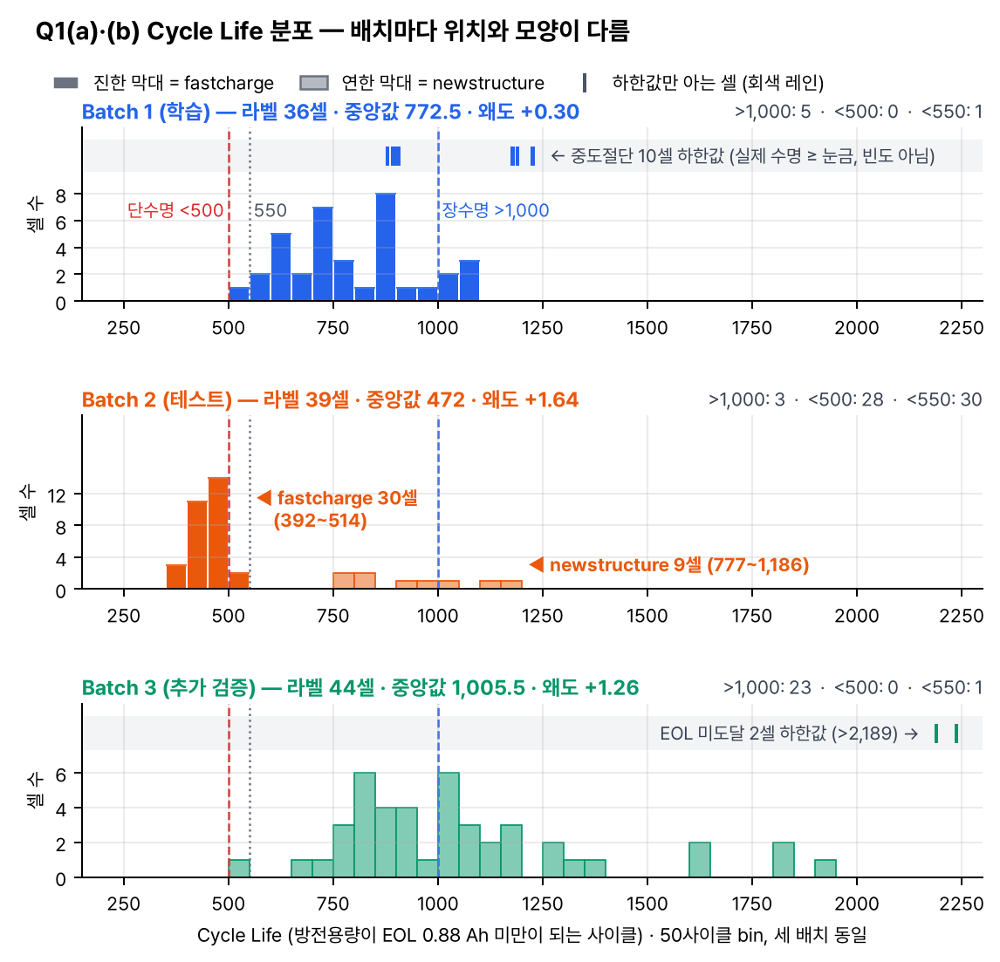
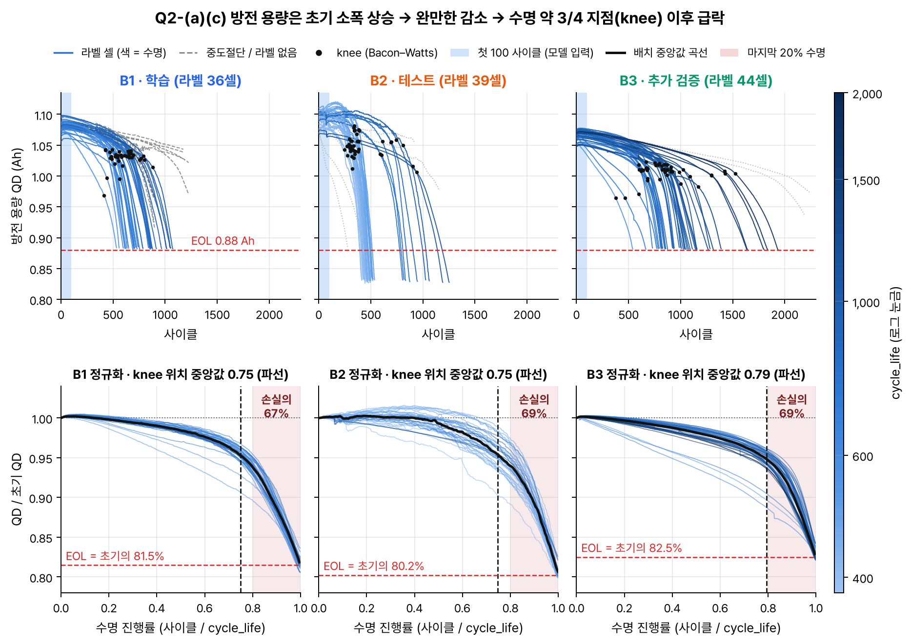
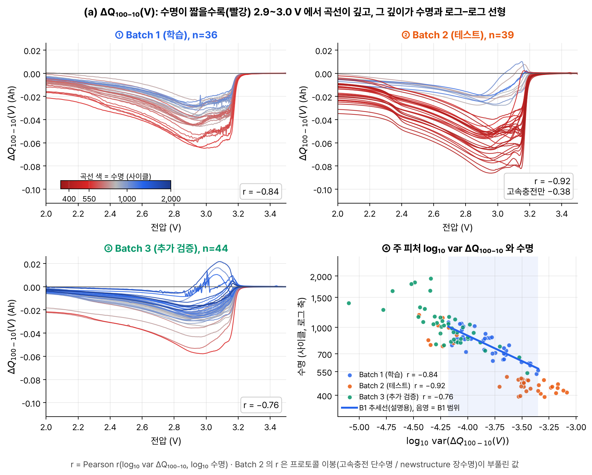
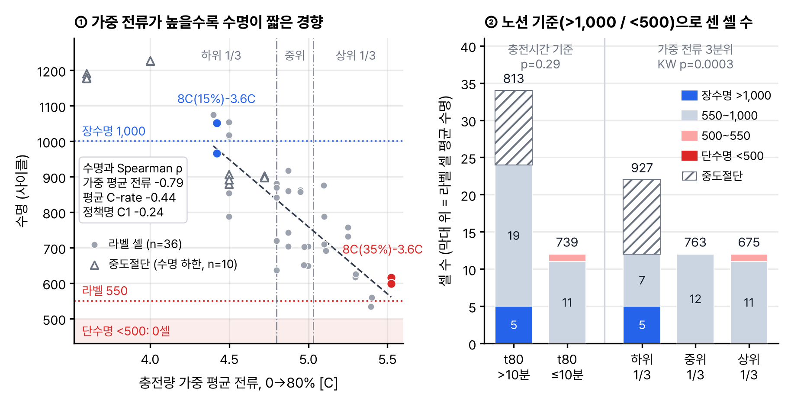
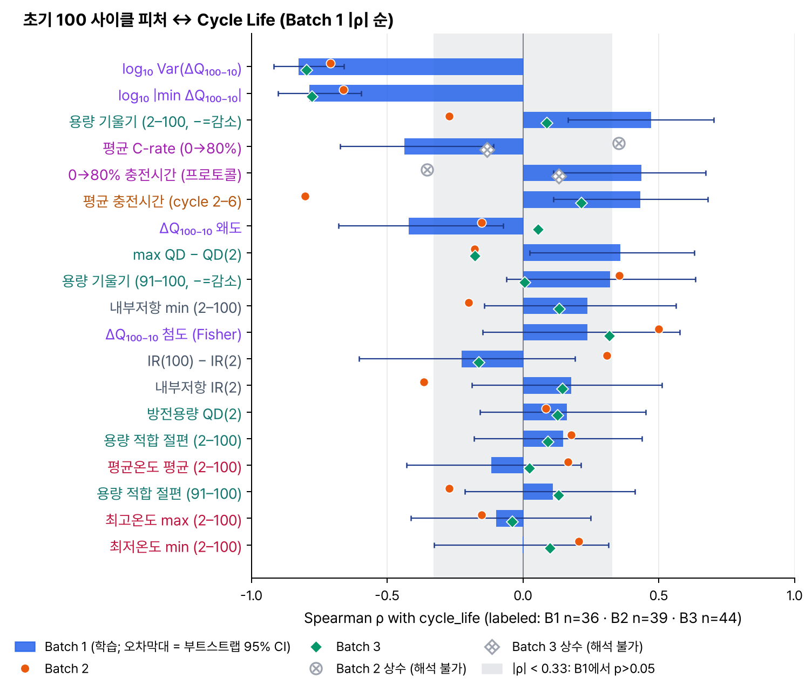
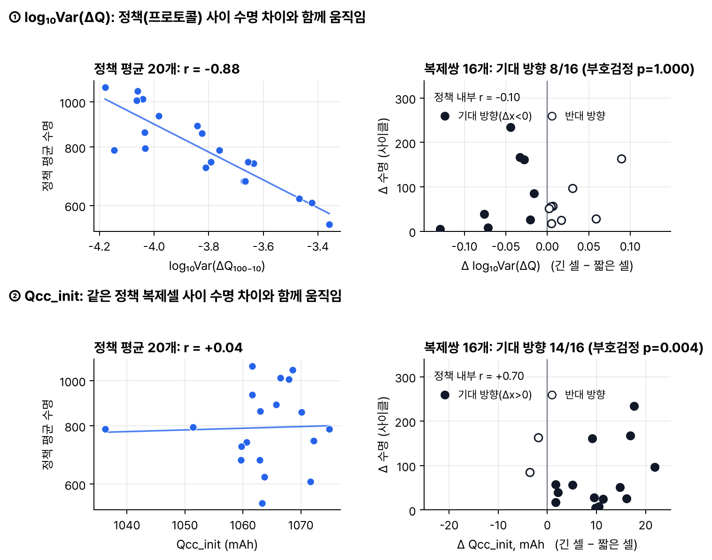

# ESS 배터리 수명 예측 — 모델 설계 전략 (DAY 1)

## 0. 요약

**문제 정의.** 셀의 초기 100 사이클(실제 입력은 cycle 2\~100)만으로 cycle_life를 예측한다. cycle_life는 방전 용량이 EOL 0.88 Ah(정격 1.1 Ah × 80%) 미만으로 처음 떨어지는 사이클이다(노션 Target 「cycle_life - EOL(80% SOH 도달)까지의 총 사이클 수」). 학습은 Batch 1로 하고, 테스트는 Batch 2로 1회 한다. Batch 3는 선택 검증이다. ESS 운영에서는 이 예측으로 「배터리 교체 비용 = CAPEX 30\~40%」에 해당하는 교체 시점을 용량이 줄기 전에 계획할 수 있다.

**결론 3줄**

1. **Task·Target:** Regression을 택한다. Target Variable은 cycle_life이고, 모델 안에서는 log10(cycle_life)를 학습한 뒤 10^ŷ의 MAPE로 평가한다. 학습 셀은 Batch 1 라벨 36셀이다. B1에서 550 미만 셀은 1/36(2.8%)뿐이어서 분류 경계를 학습할 근거가 없다.
2. **핵심 피처:** dQ_logvar = log10 var(ΔQ₁₀₀₋₁₀(V)) 하나로 B1 log 수명 분산의 71%를 설명한다(r −0.84; ρ −0.83 [95% CI −0.92, −0.66]).
   - **후보 Qcc_init:** cycle 2\~6 CC 방전 2.0 V 끝점의 중앙값이다. B1 복제셀 간 차이를 설명한다(편상관 +0.68, 복제쌍 14/16).
   - **한계:** Qcc_init은 Qdlin 절대 수준이라 노션 경고 「충전 커브 시작 시점이 배치별로 상이 : Qdlin 변수를 단순 비교하면 왜곡 발생」에 그대로 해당한다(라벨 없이 잰 배치 이동 → 예측 ×0.96/×0.94/×0.90, 고정 EOL 헤드룸 효과 포함, §8).
   - **처리:** M1(+Qcc_init)과 M0(ΔQ 단독) 중 선택은 B1 grouped-CV의 사전 고정 1-SE 규칙으로만 정하고, DAY 2에는 ΔQ-only M0 행을 항상 병기한다.
3. **후보 모델·검증:** 후보는 단순한 순서로 M0 OLS(원논문 variance model), M1 Ridge, M2 Elastic Net, M3 GPR(예측구간), M4 얕은 RF/GBR(비교군)이다. 정책 단위 Hold-out 9셀과 정책 단위 GroupKFold(5)×20 nested CV에서 1-SE 규칙과 외삽 게이트로 고른다. Batch 2는 1회만 평가한다.

| 핵심 수치 (근거는 Batch 1) | 값 | 설계 결정 |
|---|---|---|
| 550 미만 셀 비율 | B1 1/36 (2.8%) · B2 30/39 (76.9%) | 회귀 택1. B2 비율은 위험으로만 기록 |
| dQ_logvar ↔ log10 수명 | r −0.84 (r² 0.71) · ρ −0.83 [95% CI −0.92, −0.66] | 주 피처, M0 기준선 |
| 첫 100 사이클 용량 변화 | 총 손실의 약 0.6%, knee 최소 246 사이클 | 용량 기울기·knee 제외, ΔQ(V) 사용 |
| 정책이 설명하는 수명 분산 | ω² 0.76, 복제쌍 수명 차 최대 37% | 정책 단위 분할, 충전 조건 피처 미사용 |
| 학습 라벨 범위 | 534\~1,074 (2.0배), 중도절단 #00\~04는 피처 범위 밖 | 외삽 가능한 선형 1순위, 하한 게이트 |

**구성·표기.**

- **구성:** 1 INPUT → 2\~6 EDA(Q1\~Q5) → 7 연결 지도 → 8\~10 모델 설계 전략 → 11 DAY 2 검증 순서다.
- **Q별 구조:** 노션 「(참고) EDA to Model Strategy」의 4단 구조(목적 → 해결 방법 → 변경 전/후 → 시사점)를 따른다. 이어서 노션 하위 항목별 발견·해석·시사점을 정리하고, 마지막에 ESS 관점을 덧붙인다.
- **표기:** 용량 기울기는 mAh/100 사이클이며 음수는 감소다. 추정은 Theil–Sen이고, OLS를 쓴 곳은 따로 표시했다. 첨도는 Fisher excess다. ρ는 Spearman, r은 Pearson이며, 상관은 인과가 아니다.

## 1. INPUT — 데이터 정의

| 배치 (노션 파일) | 노션 활용 | 실제 셀 구성 | 라벨 / 중도절단 / NaN | 역할 |
|---|---|---|---|---|
| Batch 1 (2017-05-12) | 「원논문의 학습 데이터셋」 | fastcharge 46 | 36 / 10 / 0 | 학습 36셀, 중도절단은 외삽 진단 |
| Batch 2 (2018-02-20) | 「원논문의 1차 테스트셋」 | fastcharge 30 · newstructure 9 · varcharge 4 · slowcycle 4 | 39 / 0 / 8 | Test 1회 (varcharge·slowcycle 제외) |
| Batch 3 (2018-04-12) | 「원논문의 2차 테스트셋」 | newstructure 46 | 44 / 0 / 2 | 선택 검증 (#23·#32 EOL 미도달) |
| extra (2018-04-03) | 「충전 최적화 실험용」 | varcharge | — | 사용 안 함 |

- **Y:** QD가 처음 0.88 Ah 미만이 되는 사이클이며, 모델 안에서는 log10을 쓴다. B1·B3는 EOL 직전에 기록이 끝나므로 '기록 사이클 수 + 1'을 수명으로 한다. B2는 약 0.825 Ah까지 측정했으므로 기록 길이를 수명으로 쓰면 안 된다.
- **X:** cycle 2\~100의 summary(QD·IR·온도·chargetime)와 Qdlin(1,000점; 실제 격자 3.5→2.0 V)이다. '사용 사이클 ≤100'은 assert로 강제한다.
- **가설:** 용량이 거의 줄지 않은 초기에도 ΔQ₁₀₀₋₁₀(V) = Qdlin[99] − Qdlin[9]에 열화 정보가 있다(원논문). Q3에서 B1으로 확인했다.

**데이터 품질 처리** (행은 그대로 두고 값만 NaN으로 바꾼다. 규칙은 테스트 전에 고정했다)

| 항목 | 확인 내용 | 처리 |
|---|---|---|
| B1 cycle 1 | 빈 더미(QD 0, Qdlin 없음) | 입력은 cycle 2부터 |
| 중도절단 10셀 | B1 #00·01·02·03·04·08·10·12·13·22(하한 879\~1,227). 이들을 빼면 중앙값 772.5, KM 추정은 860 | 타깃에서 제외, #00\~04는 외삽 게이트로 사용 |
| 라벨 NaN 10셀 | B2 varcharge 4·slowcycle 4, B3 #23·#32(>2,189·>2,237) | 지도학습에서 제외 |
| IR 결측 | B2 #41\~46은 전 사이클 IR = 0 | M2 풀에서만 쓰고, Pipeline에서 중앙값으로 대체 |
| chargetime 등 이상값 | chargetime ≤0 또는 >100분, QD/QC ≤0 또는 >1.2 Ah, 온도 ≤0 | NaN (clean_summary) |
| Qdlin 끝점·스파이크 | 끝점 ≤0 또는 >1.2 Ah(cycle 2\~100): 전체 셀 B1 4·B2 13·B3 0개(라벨 셀 B1 2·B2 8). B1 >3 mAh 스파이크 9회 | cycle 2\~6 중앙값과 Theil–Sen으로 흡수 |
| 정책 문자열 ≠ 실측 | B3 '4.8C(80%)-4.8C' 8셀의 실측값은 4.36C·11.0분 | 충전 값은 실측 I(t)로 계산 |

**받은 파일에서 확인한 사항 (참고)** — 분할·지표·보고 형식은 노션대로 유지하고, 아래는 해석에만 반영한다.

| 노션 기준 | 받은 파일(Kaggle)에서 확인한 내용 | 반영 |
|---|---|---|
| 「Batch 1/2는 유사하지만, Batch 3는 분포 차이 있음」 | Batch 3의 분포 차이는 확인된다(KS D 0.47). 받은 2018-02-20 파일에는 newstructure 9셀이 함께 있고, fastcharge 30셀(392\~514)은 B1(534\~1,074)보다 짧은 쪽에 모여 B1↔B2 KS D가 0.77이다 | 원논문 Batch 2 구성과 같은 파일인지 확인이 필요해 보인다. Gap 가설 H1·H5에 반영 |
| 「150 \~ 2,300 사이클」 | 세 배치 라벨 범위는 392\~1,935이고, 학습 B1은 534\~1,074다 | 학습 범위 밖 예측(외삽)을 설계 요구로 둔다 |
| 「100 사이클 후 SOH=95% → 아직 5% 열화」(예시) | 이 데이터의 cycle 100 SOH 중앙값은 약 100%(98.1\~101.2%)다 | 용량만으로는 조기 예측이 어려움 → ΔQ(V) 사용 근거 |
| 「EOL(80% SOH 도달)」 | 0.88 Ah(정격 1.1 Ah의 80%)는 초기 용량의 81.5 / 80.2 / 82.5%(B1/B2/B3)다 | 헤드룸 단서 (§8) |

## 2. Q1. Cycle Life 분포는 어떻게 생겼는가?

| 구분 | 내용 |
|---|---|
| 목적 | 타깃 분포·라벨 품질·장/단수명 비율·이상치를 확인해 과제 유형, 타깃 척도, 학습 셀을 정한다 |
| 해결 방법 | 라벨 셀만 집계(중도절단은 KM 하한), 공통 50-사이클 bin 적용, Tukey·robust z와 품질 플래그 점검 |
| 비교(전·후) | 중도절단 반영 시 중앙 772.5 → 860, log10 변환 시 왜도 +0.30 → −0.01, B2 분해 시 이상치 9 → 0 |
| 시사점 | B1은 <550이 1셀뿐이고 상단이 잘림 → log10 회귀, 외삽 가능한 선형 모델 1순위, 짧은 셀은 유지 |

| 항목 | 발견 | 해석 | 시사점(모델링) |
|---|---|---|---|
| 「150 \~ 2,300 사이클 Histogram」 | B1 534\~1,074 단일 군집, B2 392\~514 + 777\~1,186 이봉, B3 541\~1,935 꼬리 | 배치마다 모양부터 다르다(B2 왜도 +1.64는 혼합 효과). B1은 약 10% 짧게 치우침 | 타깃 = B1 36셀의 log10(cycle_life). 하한은 '예측 ≥ 하한' 점검에만 사용 |
| 「장수명(>1,000)/단수명(<500) 비율 확인」 | 장/단: B1 5/36·0, B2 3/39·28/39, B3 23/44·0. <550: B1 2.8%, B2 76.9% | 단수명은 B2 fastcharge에만 있고, 학습·테스트 비율이 정반대다 | B1 음성 1셀이라 분류 불가 → 회귀 택1. B2 비율은 위험으로만 기록 |
| 「이상치 셀 식별 - 왜 유독 짧은가?」 | 하단 이상치 0. 짧은 13셀 중 10개가 프로토콜형. B1 짧은 4셀은 dQ_logvar 상위 10%(p=3.4e-5) | 오류가 아닌 연속 꼬리다. 100 사이클에 이미 ΔQ 분산이 크다(상관) | 유지(#20 = 유일한 <550). B3는 노션 「이상치 제거 고려」로 6셀 포함/제외 병기 |

**ESS 관점:** EOL 도달 셀만 보면 수명이 약 10% 짧게 보이고, 복제셀도 최대 1.37배 차이가 나며, 로트가 바뀌면 분포가 이동한다. 따라서 교체 시점은 사양표가 아니라 셀 단위 초기 신호로 정하고, 신규 로트는 재검증한다.

## 3. Q2. 열화 곡선 - 방전 용량이 어떻게 감소하는가?

| 구분 | 내용 |
|---|---|
| 목적 | QD 감소 모양(가속·knee)을 보고 초기 용량의 수명 정보, 타깃 척도, 배치 위험을 판단한다 |
| 해결 방법 | clean_summary + 9-사이클 이동중앙값, 절대/정규화 축 비교, Theil–Sen 기울기, Bacon–Watts knee |
| 비교(전·후) | B1 knee 413\~881 → 정규화 시 수명의 0.75로 수렴. 초기 기울기 ρ +0.52 → ΔQ 통제 +0.00 |
| 시사점 | 수명 차이 = 시간 척도 차이 → log10 타깃·MAPE, 초기 기울기 제외, knee는 누수 |

| 항목 | 발견 | 해석 | 시사점(모델링) |
|---|---|---|---|
| 「사이클 별 Qd 추이 시각화」 | 113/119셀이 '상승 → 완만 → 급락'. 정점 cycle 37 / 81 / 30. 마지막 20% 수명에 손실 67\~69% | 비선형이며, 셀 간 차이는 완만 구간의 길이다. B2만 초기 상승이 약 2배 크고 늦다 | log10·MAPE. 위험: B2 22/39셀은 cycle 10→100 용량 증가 → ΔQ 창 점검 |
| 「열화 속도가 일정한가, 가속되는가?」 | 중기 −8.6 / −15.4 / −6.5 → 말기 −88 / −154 / −66 mAh/100 사이클(약 9배). 첫 100 사이클 ΔQD는 손실의 0.6% | 말기에 가속된다. 초기 정보(ρ +0.52 [95% CI +0.22, +0.74])는 ΔQ가 이미 담고 있다 | 초기 기울기·ΔQD 제외, 중·말기 값은 누수. 용량은 다중 사이클 중앙값 |
| 「Knee point - 급격한 열화 시작점 탐색」 | knee 중앙 578 / 341 / 820(최소 246), onset ≥157. cycle 100 전 knee는 0/119 | 100 사이클 안에는 급락이 없어 잠재 신호가 필요하다. knee/수명 비는 일정(ρ −0.07) | knee 금지(cycle ≤100 assert). 배율 구조 → log10. 준선형 6셀은 오차 분석 |

**ESS 관점:** SOH만 보면 knee(약 95%) 뒤 수명의 약 25%(194.5 사이클)만 남아 리드타임이 부족하다. SOH ≈ 100%인 cycle 100에 ΔQ(V)로 예측해야 「예지 보전 (PdM)」이 가능하다. 0.88 Ah는 초기의 80.2\~82.5%라 상대 SOH 현장 기준엔 보정이 필요하다.

## 4. Q3. ΔQ(V) 곡선 - 초기 사이클에서 차이가 보이는가?

| 구분 | 내용 |
|---|---|
| 목적 | 초기 100 사이클의 수명 신호를 B1 36셀용 스칼라로 압축하고, 노션 Qdlin 메모의 제약을 정량화 |
| 해결 방법 | ΔQ₁₀₀₋₁₀(V) = Qdlin(100) − Qdlin(10)을 1,000점에서 계산, B1 3분위로 깊이/모양 분리, 통계값 9개 비교 |
| 비교(전·후) | 끝 용량 변화는 −0.6%뿐이나 2.9\~3.0 V 편차는 그 5.8배. 원시 Qdlin \|r\| 0.17 → ΔQ 0.84 |
| 시사점 | 수명은 ΔQ '깊이'가 가른다 → dQ_logvar가 분산의 71%를 설명. 원시 Qdlin 수준은 제외(§8) |

| 항목 | 발견 | 해석 | 시사점(모델링) |
|---|---|---|---|
| 「사이클 100번 - 사이클 10번의 Q(V) 차이 계산」 | 모든 셀이 min ΔQ < 0이며 손실은 2.9\~3.0 V에 집중. \|min ΔQ\| B2 0.054 > B1 0.038 > B3 0.025 Ah | 용량이 줄기 전에도 수명 차이가 보인다. 깊이 순서와 수명 분포 순서가 같다 | ΔQ₁₀₀₋₁₀(V)를 핵심 입력으로. 36셀이라 곡선 대신 스칼라로 압축 |
| 「장수명 셀 vs 단수명 셀의 ΔQ 형태 비교」 | 통합 비교는 배치에 교란됨(단수명 28셀 모두 B2). B1 하위 1/3이 1.66배 깊고, 모양 상관은 0.998 | 장·단수명은 '모양'이 아니라 '깊이'로 갈린다 | log10 var를 주력으로, 모양 통계는 제외. log–log 선형 → log10 타깃 |
| 「이를 구분할 수 있는 통계값으로 피쳐 추출」 | log10 var ρ −0.83 [95% CI −0.92, −0.66], AUC 1.00(하위 vs 상위 1/3). min·mean과 \|r\| ≥ 0.97 중복, 형태는 통제 후 ≤ 0.30 | 모두 같은 깊이 정보다. 정책 평균 r −0.88, 복제쌍 −0.10 → 주로 프로토콜 간 신호 | dQ_logvar 1개로 M0. 원시 Qdlin 수준은 노션 Qdlin 메모(오프셋 0.027 Ah)로 제외 |

**ESS 관점:** 용량이 0.6%만 줄어든 100 사이클 시점(B1 수명의 9\~19%)에 장·단수명을 가를 수 있어, 시운전 단계 조기 선별에 쓸 수 있다. 다만 이 신호는 주로 운전 조건을 반영하므로(복제쌍 r −0.10), 같은 조건 셀 사이의 선별력은 제한적이다.

## 5. Q4. 충전 조건 (C-rate)과 수명의 관계는?

| 구분 | 내용 |
|---|---|
| 목적 | 「고속 충전 셀이 정말 수명이 짧은가?」에 노션 기준으로 답하고, 충전 조건이 피처인지 누수 경로인지 판단한다 |
| 해결 방법 | 정책별 수명과 ω²를 구하고, '고속'을 t80 ≤10분과 실측 가중 전류 I_qw = ∫I²dt/∫Idt 3분위 두 기준으로 정의. ΔQ 통제 편상관 확인 |
| 비교(전·후) | B1 ρ: C1 −0.24 → C-rate −0.44 → I_qw −0.79. t80 기준 739 vs 813, I_qw 기준 927 → 763 → 675. ΔQ 통제 시 −0.24 |
| 시사점 | '고속 → 단수명'은 성립하지 않는다. ΔQ와 중복(ρ 0.90)이고 정책 자체가 누수 경로(ω² 0.76) → 충전 피처 제외 |

| 항목 | 발견 | 해석 | 시사점(모델링) |
|---|---|---|---|
| 「충전 프로토콜별 평균 수명 비교」 | B1 정책 20개의 수명 546.5\~1,074, ω² 0.76, 복제쌍 차 최대 37%. 4.8C(80%)-4.8C: B2 fastcharge 484 / B1 753 / B2 newstructure 872 | 배치 안에서는 정책이 수명을 가르지만, 같은 전류도 배치에 따라 1.8배 차이 난다(원인 미상) | B1 CV·Hold-out은 정책 단위로 분할하고 정책명은 쓰지 않음(노션 Hold-out 사유와 같은 누수 구조) |
| 「고속 충전 셀이 정말 수명이 짧은가?」 | B1 <500 0개, <550 1개. t80 739 vs 813(p=0.29). I_qw 927 → 763 → 675(p=0.0003), 장수명은 모두 하위 1/3 | 3.6\~5.4C 범위에서는 성립하지 않는다. 충전 속도보다 고전류 비중이 수명과 함께 움직인다(상관) | I_qw·t80·C-rate 제외(통제 후 −0.24). 위험: B2·B3는 C-rate 상수(4.79\~4.81C)이고, 같은 I_qw에서 B2 fastcharge 수명이 41% 짧음 |
| 「충전 전류 패턴과 열화 속도 상관 분석」 | I_qw ↔ 초기 기울기 B1 −0.61. 피크 전류 ↔ Tmax +0.77·IR +0.79(수명과는 −0.22). B2 fastcharge −0.15·B3 −0.31로 약화 | 고전류 충전량은 용량 감소와, 피크 전류는 온도·저항과 연관된다. 약해진 원인은 특정 불가 | Tmax·IR·기울기는 스트레스 대용으로 쓰지 않는다. 충전 값은 실측 I(t)로(B3 '4.8C'의 실측은 4.36C) |

**ESS 관점:** 이 데이터는 3.6\~8C(0→80% 9\~13분) 충전이지만, 일반 ESS는 1C 이하다. 그래서 「열화 속도 예측 → 충방전 전략 최적화」로 바로 옮길 수 없다. 같은 프로토콜도 배치별 수명이 최대 1.8배 다르므로, 교체 시점은 셀별 초기 신호로 정한다.

## 6. Q5. 상관관계 - 어떤 신호가 수명과 연관되어 있는가?

| 구분 | 내용 |
|---|---|
| 목적 | B1에서 수명과 연관된 초기 신호를 고른다. 중복을 정리하고 ΔQ를 통제한 뒤 남는 정보를 확인해 피처와 M0/M1/M2를 정한다. B2·B3는 부호가 일관적인지만 본다 |
| 해결 방법 | 피처 19개에 대해 배치별 Spearman·Pearson 상관을 구했다(B1은 부트스트랩 CI, Bonferroni·BH 보정). 중복은 B1 군집(평균 \|ρ\| ≥ 0.8)과 VIF 4단계로 정리했다. 조건부 기여는 dQ_logvar 통제 편상관과, 같은 정책의 복제쌍 16개로 점검했다(기울기는 OLS) |
| 비교(전·후) | B1 단독 3\~7위(기울기·C-rate·충전시간·왜도, \|ρ\| 0.42\~0.47)는 dQ_logvar 통제 후 \|r\| ≤ 0.30으로 유의하지 않다. VIF는 후보 17개 최대 14,628에서 그룹 대표만 남기면 4.4가 된다(M2 풀 4.9) |
| 시사점 | 확실한 신호는 ΔQ 크기 하나다(Bonferroni 통과 2개가 모두 ΔQ 진폭). 원논문 피처 조합은 그룹 대표 + Elastic Net으로 다루고, 복제셀 간 차이는 (d)에서 점검한다 |

| 항목 | 발견 | 해석 | 시사점(모델링) |
|---|---|---|---|
| 「초기 사이클 피켜들과 Cycle Life 상관 계수 확인」 | 최강 log10 Var(ΔQ) ρ −0.83 [95% CI −0.92, −0.66], 다음 기울기(OLS) +0.47·C-rate −0.44. Bonferroni 유의 2개 | 확실한 신호는 ΔQ 크기 하나(상관). 이분산 BP p 0.002 → log 0.017로 일부 잔존 | log10 타깃(MAPE·곱셈형 열화), M0 기준선, 외삽 거리별 예측구간 |
| 「가장 강한 관계 식별」 | 세 배치 유지 신호는 ΔQ뿐(ρ −0.83 / −0.71 / −0.80). B1 선 대비 수명비 B3 0.98, B2 fastcharge 0.76(−24%; 같은 ΔQ 창 중앙값 −27%) | B3는 관계 동일, 범위만 다름. ΔQ는 자기 차분이라 B2 이동은 시작 시점 왜곡이 아님 → break-in(Q2)이 후보 | dQ_logvar 고정, 선형 1순위(B1 #00\~04가 이미 범위 밖). B2 약 1.3배 과대예측은 위험으로 기록 |
| 「멀티클리니어리티 문제 확인」 | 중복 그룹 6개(평균 \|ρ\| 0.82\~0.99), 17개 중 13개가 VIF ≥10(원논문 조합 618). 대표만 남기면 최대 4.4 | G1·G3·G4(용량 수준·충전 조건·ΔQ 진폭)는 정의상 같은 양(Pearson \|r\| 0.98\~1.00) → OLS 계수 불안정 | 그룹당 측정값 1개 + 축소. summary QD(2)는 B2 fastcharge +17.2 mAh(×1.14) 이동으로 제외 |
| **(추가 점검)** (d) 조건부 기여 (B1) | Qcc_init(cycle 2\~6 2.0 V 끝점)의 편상관 +0.68(p=8e-6). 정책 평균 r: ΔQ −0.88 / Qcc +0.04. 복제쌍: ΔQ 8/16 / Qcc 14/16(p=0.004) | ΔQ와 겹치지 않는 보완 신호(상관). 단 Qdlin 절대 수준이라 노션 Qdlin 경고 대상이고 고정 EOL 헤드룸 효과도 포함한다(§8) | 후보로만 둔다. M1 vs M0는 B1 grouped-CV 1-SE 규칙으로만 결정하고, DAY 2에 ΔQ-only M0 행을 항상 병기 |

**ESS 관점:** 같은 운전 조건 랙 안의 셀 선별(「배터리 제조사 수율 선별 → 팩 구성 최적화」)에는 ΔQ만으로 부족하다. 초기 용량 후보는 로트·설비에 따라 기준선이 이동하므로, 새 로트에서는 기준선을 재확인하고 M0와 함께 쓴다.

## 7. EDA → 모델 전략 연결 지도

| EDA 발견 | 해석 | 시사점 | 결정 |
|---|---|---|---|
| Q1: B1 라벨은 534\~1,074 단일 군집이고, <550은 1셀(2.8%) | 단수명 클래스가 사실상 없는 연속 분포 | 550 경계 학습 불가 → 스크리닝은 사후 임계로 | Regression, Target = log10(cycle_life), 학습 = B1 36셀 |
| Q1: 중도절단 제외 시 772.5 vs KM 860. #00\~04는 피처 범위 밖(−5.01\~−4.44 < −4.18) | 타깃이 짧은 쪽으로 치우침. #00\~04는 B1 안에서 유일한 외삽 시험 셀 | 하한값은 타깃이 아니라 진단에 사용 | 타깃 제외, '#00\~04 하한 위반 ≥3/5 → 부적격' 게이트 |
| Q2: knee 최소 246, onset 최소 157. 첫 100 사이클 용량 변화 0.6%, 초기 기울기 통제 후 +0.00 | 첫 100 사이클 용량에는 수명 정보가 없고, 있는 정보는 ΔQ가 담음 | 기울기는 추가 가치 없음, knee는 미래 정보 | 기울기·ΔQD 제외, knee 금지(cycle ≤100 assert) |
| Q1·Q2·Q5: 왜도 +0.30 → −0.01, knee/수명 0.75 일정, BP 0.002 → 0.017 | 곱셈 구조이고 MAPE는 상대오차 | log 오차가 평가 척도와 맞음. 외삽 불확실성은 별도 | log10 타깃 + 10^ŷ MAPE, 외삽 거리별 예측구간 |
| Q3: ΔQ 깊이 r −0.84, ρ −0.83 [95% CI −0.92, −0.66]. 진폭 통계끼리 \|r\| ≥ 0.97, 형태 통계는 비유의 | 수명 정보가 진폭 하나에 모여 있음 | 스칼라 1개로 요약 | dQ_logvar = 전 모델 필수 피처, M0 = 기준선 |
| Q3: 노션 「충전 커브 시작 시점이 배치별로 상이 : Qdlin 변수를 단순 비교하면 왜곡 발생」 확인. CV 방전분 15.6 vs 38.2 mAh, 오프셋 0.027 Ah ≈ 수명 신호 | 절대 수준을 배치끼리 비교하면 왜곡되고, 셀 자기 차분에서는 상쇄됨 | 피처를 셀 안 차분으로 정의 | 원시 Qdlin 곡선 수준·summary QD 절대값 제외 |
| Q5-(d): Qcc_init 편상관 +0.68, 복제쌍 14/16(ΔQ는 8/16) | 보완 신호지만 Qdlin 절대 수준이라 위 노션 경고 대상(예측 ×0.96/×0.94/×0.90 이동, 헤드룸 포함) | 배치 이동·라벨 정의에 의존하므로 기본 피처가 아님 | M1은 후보, 1-SE 규칙으로만 채택. DAY 2에 ΔQ-only M0 행 병기 |
| Q4: 정책 ω² 0.76, 복제쌍 차 최대 37%. I_qw −0.79는 통제 후 −0.24 | 복제셀이 train/valid로 갈리면 정책 평균이 샘. 실험 조건 피처의 추가 정보는 작음 | 정책 단위로 분리하고, 충전 피처는 주력에서 제외 | Hold-out 5정책 9셀, GroupKFold(5)×20 nested, 정책명 미사용 |
| Q5·Q1: VIF 최대 14,628(원논문 조합 618). 라벨 범위 2.0배·상단 잘림 | n=27에서 OLS가 불안정하고, 범위 밖 예측이 필요 | 그룹 대표·축소, 외삽 가능한 모델 | M2 Elastic Net(VIF ≤4.9), 선형 1순위, M3 GPR, M4 트리는 비교군 |

## 8. 모델 설계 전략 ① Feature Engineering

노션 「EDA에서 발견한 내용 토대로 유의미한 변수 선별」에 따라 Batch 1과 도메인 근거로 선별했다. B2·B3 수치는 위험을 설명할 때만 쓴다.

| 피처 | 정의 | 결정 | 근거 |
|---|---|---|---|
| dQ_logvar | log10(var(Qdlin[99] − Qdlin[9])), 1,000점, ddof=0, 평활화 없음(원논문 정의) | **주 피처** (M0\~M2) | r −0.84, ρ −0.83 [95% CI −0.92, −0.66]이고 19개 중 Bonferroni 유의다. 셀 자기 차분이라 오프셋이 상쇄된다. 다만 주로 프로토콜 간 신호다(복제쌍 r −0.10) |
| Qcc_init | cycle 2\~6 Qdlin 2.0 V 끝점(CC 방전 종료 용량)의 중앙값 [Ah] | **후보** (M1, 1-SE 규칙) | 편상관 +0.68, 복제쌍 14/16, VIF 1.06이다. 단, Qdlin 절대 수준이라 노션 Qdlin 경고(아래)의 대상이다 |
| M2 풀 전용 8개: CC break-in, dQ_skew·dQ_kurt(Fisher), fade_slope_91_100(OLS), chargetime_avg5, Tavg_mean, IR_min, IR_diff | 원논문 discharge/full에 대응하는 측정값 | M2 풀 전용 | ΔQ를 통제하면 정보가 작거나 불안정하다. break-in은 +0.30 → −0.62로 부호가 바뀌고 #10 하한을 −12.7% 벗어난다. 왜도 +0.30, 첨도 −0.05, 기울기 +0.05, 충전시간 +0.12, 온도·IR(ΔQ·Qcc 통제) \|r\| ≤ 0.19다 |
| summary QD_2·QD_init·절편, log\|min ΔQ\|·min·mean | 같은 정보를 다른 정의로 잰 값 | 제외 | CC 끝점과 r 0.995이고 CV 방전분이 섞여 있다(B2 fastcharge +17.2 mAh, ×1.14). 진폭 계열은 dQ_logvar와 \|r\| 0.97\~0.996이다 |
| 초기 기울기·ΔQD, 충전 조건(정책명·C-rate·t80·I_qw), ΔQ₅₋₄·형태, 원시 Qdlin 수준, Tmax | 추가 정보가 없는 값 | 제외 (I_qw는 사후 해석 표에만) | 통제 편상관은 기울기 +0.00, I_qw −0.24, ΔQ₅₋₄ −0.17, 형태 \|r\| ≤ 0.30이다. 원시 Qdlin 수준은 B1 \|r\| ≤ 0.17이다. 충전 조건은 실험 조건이라 누수 경로가 된다(ω² 0.76) |
| knee · onset · 중기/말기 기울기 | cycle 100 이후 정보 | 제외 (해석 전용) | knee 최소 246, onset 최소 157 → 누수 |

**노션 경고 대응 — 「충전 커브 시작 시점이 배치별로 상이 : Qdlin 변수를 단순 비교하면 왜곡 발생」.** 이 파일에서 경고 내용을 확인했다. 기록 첫 전압은 B1 2.02 V(휴지), B2·B3 2.11\~2.35 V(충전 중)다. CV 방전분은 B1 15.6 mAh, B2 38.2 mAh다. 원시 Qdlin 배치 차이(최대 0.027 Ah)는 수명 신호(0.025\~0.038 Ah)와 크기가 같다. 이에 따라 다음 규칙을 둔다.

1. 전압별 Qdlin 곡선 수준과 summary QD 절대값은 쓰지 않는다.
2. dQ_logvar는 셀 자기 차분이므로 오프셋이 상쇄된다.
3. 예외인 **Qcc_init은 Qdlin 절대 수준이라, 노션이 경고한 배치 간 단순 비교에 그대로 해당한다.**
   - 라벨 없이 잰 이동은 B2 fastcharge −5.3 mAh(−0.57 SD), B2 newstructure −8.7(−0.94 SD), B3 −14.5(−1.56 SD)다. B1 계수 3.30 log10/Ah로 환산하면 예측은 ×0.96 / ×0.94 / ×0.90이다.
   - 고정 0.88 Ah EOL(초기 용량의 80.2\~82.5%)에서는 초기 용량이 곧 EOL까지의 헤드룸이 된다. 따라서 효과의 일부는 라벨 정의에서 나온다(노션 SOH는 현재/초기). 수직 이동을 가정하면 +10 mAh당 +1.2%로, 관측된 ×1.08의 일부만 설명한다.
   - 기록이 0.88 Ah 직전에 끝나므로, 상대 SOH 기준으로 재라벨링해 확인할 수는 없다.

대응:

- (a) M1/M0 선택은 B1 정책 단위 그룹 CV의 사전 고정 1-SE 규칙으로만 한다.
- (b) DAY 2 모든 행에 ΔQ-only M0 행을 병기한다.
- (c) Test 오차를 '계수 × 라벨 없는 이동량'으로 분해한다.
- (d) 테스트 배치 통계로 재중심화하거나 B2 라벨로 재보정하지 않는다(누수 방지).
- (e) M1 계수는 '고정 EOL 헤드룸과의 연관'으로 해석하며, 셀 건강도로 해석하지 않는다.

## 9. 모델 설계 전략 ② Regression vs Classification

노션의 「과제에서는 하나의 방법만 선택하고, 이를 설명하는 Target Variable 선정」에 따라 **Regression**을 택한다. **Target Variable은 cycle_life**(EOL 0.88 Ah에 도달할 때까지의 총 사이클 수)다. 모델 내부에서는 log10(cycle_life)를 학습하고, 10^ŷ의 MAPE로 평가한다. 목표는 원논문 성능인 9.1%다.

**선택 이유 (Batch 1 근거)**

1. **단수명 클래스가 없다.** 550 기준으로 B1 단수명은 1/36(#20 = 534, 2.8%)뿐이라, 결정경계를 학습할 근거가 없다.
2. **5 사이클 입력은 정보가 부족하다.** 분류 입력 ΔQ₅₋₄는 크기가 ΔQ₁₀₀₋₁₀의 1/9\~1/18 수준이다. B1 상관은 r −0.35이고, ΔQ₁₀₀₋₁₀를 통제하면 −0.17(p 0.33)이다.
3. **신호가 연속이다.** r −0.84(r² 0.71), ρ −0.83 [95% CI −0.92, −0.66]이며, 장·단수명은 깊이로 연속해서 갈린다(정규화 곡선 상관 0.998). 이진화하면 순서 정보를 버리게 된다.
4. **log10 척도가 맞다.** MAPE는 상대오차라서 log10 오차 0.041이 약 10%에 해당한다. 왜도는 +0.30 → −0.01이 되고, knee/수명 비 0.75는 수명과 무관하다(ρ −0.07). 즉 배율 구조다. 이분산이 일부 남으므로(p 0.017) 예측구간은 외삽 거리에 따라 넓힌다.
5. **ESS 의사결정에 맞다.** knee 이후에는 수명의 약 25%(194.5 사이클)만 남는다. 교체 계획에는 노션의 「RUL = EOL 도달까지 남은 사이클 수」가 필요하다. 스크리닝이 필요하면 회귀 예측에 사후 임계(<550)를 적용한다.

| 회귀 선택으로 잃는 것·감수할 것 | 영향 | 대응 |
|---|---|---|
| 노션 분류 목표(Accuracy 95.1%, 5 사이클)와 직접 비교할 수 없다 | 분류 Reporting format을 쓰지 않는다 | 회귀 예측에 사후 임계 <550을 적용해 스크리닝 용도로 해석한다 |
| 외삽이 필요하다: B1 라벨 534\~1,074(2.0배)는 노션 범위 150\~2,300보다 좁다 | 범위 밖 셀의 오차가 커진다 | 선형 모델 1순위, #00\~04 하한 게이트, 범위 안/밖 오차 분리 보고 |
| 중도절단 10셀의 정보를 쓰지 못한다 | 장수명을 과소예측할 수 있다(772.5 vs 860) → 조기 교체 비용 | 하한 위반율을 진단하고, 여유가 있으면 Tobit형 민감도 분석을 한다 |
| (위험 참고) B2 라벨의 82%가 B1 범위 밖에 있다 | B2의 550 라벨은 fastcharge/newstructure 그룹과 정확히 겹친다 | 분류로 하면 프로토콜 구분을 재게 되므로, 회귀로 이 왜곡을 피한다 |

## 10. 모델 설계 전략 ③ Modeling Strategy

노션 「확인된 데이터 특성 기반으로 모델링 전략(데이터 처리, 후보 모델 선정 등)을 제시」에 대한 답이다.

**데이터 처리**

- **셀:** 학습 B1 36셀(제거 없음), 테스트 B2 39셀, 선택 B3 44셀(원논문 제거 번호 6셀 포함/제외 병기).
- **누수 차단:** 사용 사이클 ≤100 assert, 정책명·C-rate 미사용, 피처 목록(§8) 사전 고정, 배치별 예외 전처리 없음.
- **측정 정의:** 용량은 CC 끝점·다중 사이클 중앙값·Theil–Sen. ΔQ는 원정의(잡음 셀 #09·38\~45만 21점 중앙값 민감도).
- **타깃·지표:** log10 학습 → 10^ŷ MAPE(smearing 보정 없음). 보조: RMSE, 부호 있는 오차, 과대예측 비율.
- **스케일링:** Pipeline(SimpleImputer(median, M2만) → StandardScaler)은 fold 학습부에만 fit, 배치별 표준화 금지(누수).
- **후처리:** 클리핑 없음. 피처 범위(−4.18\~−3.35)·150\~2,300 밖 예측은 외삽 플래그로 분리 보고.

| ID | 모델 | 연결된 EDA 시사점 | 위험 | 주요 하이퍼파라미터 |
|---|---|---|---|---|
| M0 | OLS: log10(life) \~ dQ_logvar. 원논문 variance model, 기준선(상수 예측 병기) | Q3: 진폭 하나로 갈리고 log–log 선형이라 외삽 가능. in-sample 8.2%(CV 아님, 상수 16.1%), #00\~04 하한 4/5 | 복제셀 편차를 설명 못 함(r −0.10). B2 fastcharge(0.76)를 약 1.3배 과대예측할 위험 | 없음 (closed-form) |
| M1 | Ridge: log10(life) \~ dQ_logvar + Qcc_init (후보) | Q5-(d): 프로토콜 간 + 복제셀 간 신호(14/16, VIF 1.06). ΔQ 분산 10배 → ×0.47, +10 mAh → ×1.08. in-sample 5.8%, 하한 5/5 | Qcc_init은 노션 Qdlin 경고 대상(§8): 배치 이동으로 B3를 ×0.90 쪽으로 과소예측할 수 있음. M0 행 병기 | StandardScaler → Ridge, alpha ∈ logspace(−4, 2, 25), 내부 GroupKFold(4, 정책) |
| M2 | Elastic Net: 측정 정의 통일 10개 풀(§8 주·후보·M2 전용), discharge 하위 5개도 보고 | Q5-(c): 원논문 조합 VIF 618 → 이 풀 4.9. 결과가 M1로 수렴하는지가 피처 선별 근거 | 약 22셀에 10개 → Gap(Train−Valid) 위험 최대. break-in 부호 불안정. Qcc_init 단서(†) | alpha ∈ logspace(−4, 0, 30), l1_ratio ∈ {0.1, 0.3, 0.5, 0.7, 0.9, 1.0}, random_state=42 |
| M3 | GPR(M1 입력†, DotProduct + RBF + White). 불확실성 보조 | Q5: 이분산 잔존(p 0.017), 범위 밖 셀 존재 → 외삽 거리에 따라 넓어지는 구간 필요 | n=27이라 커널 추정 불안정. 범위 밖에서는 M1과 같은 편향 | RBF bounds 0.1\~100, WhiteKernel(1e-3), normalize_y=True, n_restarts=5, random_state=42 |
| M4 | 얕은 RF / GBR(M1 입력†). 비교군 | 비선형 여부 확인, 노션 「LightGBM을 사용한 이유?」에 데이터로 답함 | 라벨 범위에 갇혀 #00\~04 게이트를 구조상 위반(범위 제한 시 B2 하한 14.7%) | RF 500 trees, depth {2, 3}, leaf {3, 5}; GBR {100, 300}, lr 0.05, depth 2 |

† M1\~M4에 들어가는 Qcc_init은 노션 Qdlin 경고 대상이다(§8). 그래서 DAY 2에는 ΔQ-only M0 행을 항상 병기한다.

**딥러닝·대규모 앙상블을 쓰지 않는 이유** (노션 「최신 딥러닝 기법을 사용하지 않는 이유는?」)

1. 라벨이 36셀(fold당 약 22셀)뿐이라, 1,000점 곡선을 입력하면 자유도가 정보보다 훨씬 크다.
2. 수명 정보는 진폭 하나에 모여 있다(진폭 통계 \|r\| ≥ 0.97, 모양 상관 0.998, dQ_logvar 하나로 71%).
3. 원곡선에는 노션이 경고한 배치 오프셋(0.027 Ah)이 수명 신호만큼 있어, 곡선 모델은 배치 효과를 학습할 위험이 있다.
4. 트리·부스팅은 외삽 불가로 #00\~04 게이트를 구조상 통과 못 하고, LightGBM 기본 min_child_samples=20은 27셀에 부적합 → M4는 비교군.
5. 스태킹은 새 정보 없이 자유도만 늘리고 계수 해석(ESS 설명력)을 흐린다. 그 비용은 M4 비교로 수치화한다.

## 11. DAY 2 검증 계획

노션 Performance Reporting 형식을 그대로 쓴다. 노션의 Hold-out 사유(동일 프로토콜 셀이 train/valid에 나뉘는 누수)는 **정책 단위**로 강화한다. B1에서 log 수명 분산의 89%, dQ_logvar 분산의 99%가 정책 사이에 있기 때문이다.

| 구분 | 데이터·방법 | 비고 |
|---|---|---|
| Train (Batch 1 CV) | Hold-out을 뺀 27셀·15정책, 정책 단위 GroupKFold(5)를 seed 42\~61로 20회 반복, 내부 GroupKFold(4)로 튜닝(nested) | MAPE 평균(±SD), in-sample·상수 기준선·#20·#21 out-of-fold 오차 병기 |
| Valid (Batch 1 Hold-out) | holdout_cells.csv 9셀·5정책(#16·17·23·30·31·32·33·44·45). 수명순 5층에서 양 끝 정책을 빼고 rng(42)로 층별 1개, CV보다 먼저 고정 | 선택 후 1회, 부트스트랩 95% CI·셀별 APE |
| Test (Batch 2) | B1 36셀로 재적합한 뒤 B2 39셀에 1회 적용 | 그룹별 MAPE, 부호 있는 오차, 범위 안/밖, 계수×이동량 |
| Gap (Train-Valid) | Valid − Train | (+) : 과적합 의심(CI와 비교) |
| Gap (Valid-Test) | Test − Valid | (+) : 배치간 일반화 저하 의심 |
| Gap (Target-Test) | Test − 9.1 | Target : 원논문 9.1%, (+)는 미달 |

**M0 병기.** 노션 Qdlin 경고(§8) 때문에, 어떤 모델이 선택되든 모든 칸(선택 시 Batch 3 포함)에 ΔQ-only M0 행을 나란히 둔다.

**선택 규칙 (Batch 2를 열기 전 고정)**

1. 기준 모델은 외부 MAPE 평균이 가장 낮은 모델이다. SE는 반복별 5-fold SD/√5의 20회 평균으로 구한다.
2. 기준 + 1 SE 안에서 가장 단순한 모델을 고른다(M0 < M1 < M2 < M3 < M4). in-sample 8.2% → 5.8%는 근거로 쓰지 않는다.
3. 외삽 게이트: #00\~04(하한 1,177\~1,227) 중 3개 이상에서 하한을 어기면 부적격이다.
4. Valid는 1회만 계산하고 선택을 바꾸지 않는다. Batch 2·3은 선택·ablation·재보정에 쓰지 않는다.

**Gap 가설 (테스트 전 기록)**

- **H1. Gap(Valid−Test)는 크게 (+).** B2 라벨 82%가 B1 범위 밖, fastcharge 수명비 0.76(−24%; 같은 ΔQ 창 중앙값 −27%) → 약 1.3배 과대예측. 원인 후보(상관): break-in 정점(cycle 81 vs 37)·셀 로트·충전 구조. 'B2 잔차 vs break-in'·#43 사전 점검.
- **H2. newstructure는 편향이 작고 산포가 클 것이다.** 수명비는 0.94이지만 6/9가 외삽 구간에 있고, 장수명 쪽 log 잔차가 크다(ρ −0.45).
- **H3. MAPE는 B2 짧은 셀(392\~514)이 지배할 것이다.** 비교 기준은 B1 #20·#21의 out-of-fold 오차다.
- **H4. Gap(Train−Valid)는 n=9 CI와 비교한다.** 8/9가 피처 범위 안에 있으므로, CI를 넘는 (+)는 과적합으로 판단한다.
- **H5. Gap(Target−Test)는 (+)일 것이다.** 범위 제한 모델의 B2 하한은 14.7%다. 'Batch 1/2 유사'도 재현되지 않았다(KS D 0.77 > 0.47). 이 차이를 B2로 튜닝해 줄이지 않는다.

**Batch 3 (선택).** 같은 고정 모델로 44셀을 1회 평가한다. Gap(Batch2−Batch3) = Batch 3 − Batch 2이며, (+)면 Batch 3에서 더 나쁘다는 뜻이다. Gap(Target−Test) = Batch 3 − 9.1이다. 원논문 제거 번호 셀을 넣은 결과와 뺀 결과를 함께 보고한다.

- **H6. Gap(Batch2−Batch3)는 (−)일 것이다.** B3는 B1 선 위(수명비 0.98)에 있지만 산포가 1.8배이고 47.7%가 외삽 구간이다. M1이 선택되면 Qcc_init 이동(−14.5 mAh)이 B3 예측을 ×0.90 쪽으로 낮출 수 있어, M0 행과의 차이로 분해한다.

**예측구간·재현성.** 예측구간은 정책 단위 CV 잔차 10\~90% 분위를 외삽 거리 구간별로 쓰고, 교체 계획에는 구간 하한을 권고한다. RANDOM_STATE = 42(반복 seed 42\~61), requirements.txt(Python 3.11.15, numpy 2.4.6, pandas 3.0.6, scipy 1.17.1, scikit-learn 1.9.1, statsmodels 0.15.0 등 == 고정), 수치 재현 src/eda/q1\~q5·q5d_conditional.py, 분할 고정 results/holdout_cells.csv.
